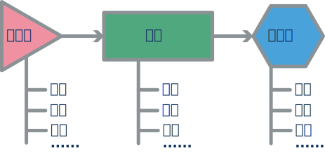
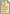
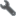

# 多通道通信仿真工具箱

[中文](README.md)
[English](README.en.md)

- [多通道通信仿真工具箱](#多通道通信仿真工具箱)
  - [简介](#简介)
  - [仿真工具结构](#仿真工具结构)
  - [模块目录及简介](#模块目录及简介)
  - [探针目录及简介](#探针目录及简介)
  - [工具目录及简介](#工具目录及简介)
  - [样例目录及简介](#样例目录及简介)

## 简介

本项目主要目标是构建一个基于MATLAB的便捷多通道仿真工具箱，工具会包含一些我在实际工程中做通信系统时对于通信的理解。当然它也会包含一些好用和易用的小工具，方便你来构筑自己的多通道通信仿真程序。同时我也会提供一些样例和说明，这些样例会包含一些经典的通信场景，并且我也会将我自己的一些研究内容做成样例放在里边。总之希望这个工程能在你了解通信工程的道路上起到作用。如果你有任何问题或者改进意见及建议都可以通过项目议题与我讨论，欢迎~

## 仿真工具结构

本项目主要旨在对多通道通信系统的各个部分实际工作状态进行仿真，其中各个模块的分布也尽量按照实际当中的通信系统进行包装。当然根据不同的研究内容，你可以自行增加或裁剪部分模块，更聚焦于其中一部分的功能仿真。不过我认为对整体进行仿真会加深对于通信系统的理解。如下图所示，一般来说对于通信系统来说有三大部分需要进行仿真：发射机、信道、接收机。而这三个部分又分别对应许多模块。在不同的场景下利用不同的手段和技术来解决相应的问题，确保接收端能够接收到有用的信息是通信的终极目的。而本项目也会从这三个部分入手尽量去构建一个完整的通信系统仿真。

当然，在本项目中的文件目录并不是按照系统结构来的，而是根据文件的不同功能属性进行组合的。本项目中的文件主要分为：

-  doc: 项目各模块的介绍文档以及使用手册
-  lib: 组成通信系统的模块文件
-  probe: 用于分析系统状态和观察系统运行的探针
-  tool: 一些可能会在构建通信系统时用到的辅助工具
-  example: 一些基于该项目的样例工程

本项目也会不断的增加新的模块，完善现有模块，希望能提供一个强大且易用的仿真工具集。

## 模块目录及简介

-  ChannelShaping: 信道脉冲成型模块，用来做基带信号的脉冲成型，一般用于解决码间串扰。
-  DigitalSignalGen: 数字序列生成器，可以生成特定测试序列或者随机的二进制序列。
-  FrameEncapsulate: 组帧模块，能够将特定的帧头与数据拼接形成一个数据帧。
-  IQMixing: 正交上混频器，利用正交信号对基带进行上混频。
-  Modulation: 调制器，将二进制序列调制成复平面上的星座符号。
-  OrthogonalMatrixLoad: 正交矩阵加载器，用于对发射的多通道信号进行正交矩阵的加载，使其发射的信号具有正交性。这个模块通常用在涡旋电磁波通信等特殊场景中。
-  PreambleGen: 帧头生成模块，利用该模块可以生成包含特定自相关或互相关序列的帧头。
-   CarrierGen: 载波发生器，利用该模块生成载波信号并送入混频器，可以同时用在发射端和接收端。
-  Channel: 信道仿真模块，根据信道的冲激响应和噪声水平实现对信道传输的仿真。
-  BaseSymbolSample: 基带符号采样器，根据特定采样率对基带的符号进行采样并输出其对应的复数值。
-  Demodulation: 解调器，将复平面上的星座信号进行判决，将信号还原成为数字信号。
-  FrameDecapsulate: 解帧模块，对收到的数据进行均衡和解帧头，回复字符数据。
-  IQDemixing: 正交下混频器，利用正交信号对射频信号进行下混频。
-  OrthogonalMatrixUnload: 正交矩阵卸载器，将多通道中的正交矩阵进行卸载，恢复成独立的数据通道。这个模块通常用在涡旋电磁波通信等特殊场景中。
-  ChannelConvolution: 信道卷积核心，对输入信道的信号与信道进行冲击响应的核心计算函数。可以通过优化该函数提升信道仿真性能。
-  InitAnalogSignal: 模拟信号结构体初始化核心，该函数定义了一种包含模拟信号基础特征等信息的结构体。具体结构和定义请参阅其说明文档。
-  InitChannelImpulseResponse: 信道冲击响应结构体初始化核心，该函数定义了一种包含信道冲击响应基础特征等信息的结构体。具体结构和定义请参阅其说明文档。
-  InitDigitalSignal: 数字信号结构体初始化核心，该函数定义了一种包含数字信号基础特征等信息的结构体。具体结构和定义请参阅其说明文档。

## 探针目录及简介

-  ProbeBitError: 误码率探针，该探针用于比对发射信号与接收信号的二进制比特流是否一致，判断其产生的误码数量和误码率。
-  ProbeChannelImpulse: 信道响应探针，图像化显示信道冲击响应。
-  ProbeConstellation: 星座图探针，图像化显示信号的星座图，并在图中标出预设星座点的位置。
-  ProbeDelay: 延迟探针，可以比较两个信号之间的时间差，也可以对比同一组信号经过传输后产生的延迟时间。
-  ProbeSignalPower: 功率探针，检测目标信号的功率。
-  ProbeSpectrum: 频谱探针，图像化显示信号的频谱，可自行调节频率显示范围及频谱的分辨率带宽(RBW)。
-  ProbeWave: 波形探针，图像化显示信号的波形。
-  UnitConvert: 自动单位转换，对输入数据进行分析，找出最适合其显示范围的缩放倍率和单位，使图像显示的坐标轴更美观。

## 工具目录及简介

-  DemixingResampleFilter: 下混频滤波器设计工具，通过输入原始信号采样率和目标采样率，来设计下混频时的抗混叠滤波器。
-  IdealOAMChannel: 理想涡旋电磁波(OAM)信道脉冲响应生成器，通过输入收发天线的参数和位置，生成理想涡旋电磁波的信道脉冲响应，天线是均匀圆阵列天线(UCA)。
-  ShapingFilterDesign: 脉冲成型滤波器设计工具，针对基带信号的符号速率和目标采样率设计对应的脉冲成型滤波器。
-  SignalResample: 信号重采样工具，对信号进行采样率变换以方便运算。
-  ZadoffChuGen: Zadoff-Chu序列生成工具，生成一组不同根的Zadoff-Chu序列。

## 样例目录及简介

-  Example1: 一个简单的基于涡旋电磁波(OAM)的通信系统仿真。
-  LoadEnvironment: 加载样例运行环境，需要加在样例运行最开始的地方。
-  FreeEnvironment: 释放样例运行环境，在样例运行结束后清理环境，一般加在样例运行末尾。